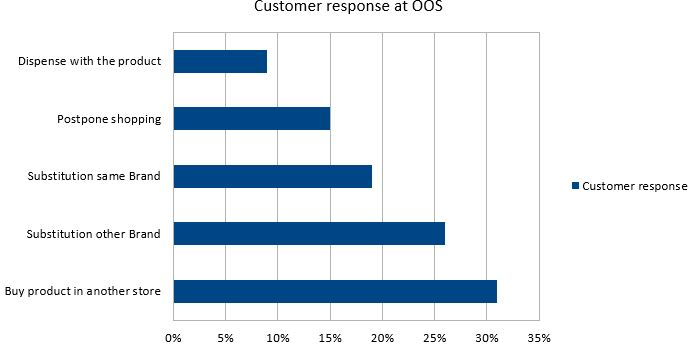

# Current situation

## Problem definition:

As an "out of stock problem" retail stores are called a shelf space that is not filled with \(sufficient\) items of the intended assortment at the time of the customer's stay. This means that the customer does not find his product at the desired time in the desired quantity at the desired location in the retail trade. 

The meta-study "retail out of stocks" by Green, Corsten and Bharadwaj is still the most comprehensive study about OOS. A total of 52 individual studies were examined and the results consolidated. The study includes 661 surveyed stores with 32 consumer goods categories considered. In addition, 71,000 individual customer data have been collected worldwide regarding their response to OOS. The following explains the causes and consequences of the OOS problem from the studies analyzed.

## Causes:

In 34% of cases, the cause of the OOS problem is the incorrect order process of the store. Often the articles are ordered too late or not at all. In 13% of cases the forecasts are calculated incorrectly. This is often due to an inaccurate inventory management of the branch.  In addition, it was found that in 25% of cases the product is located in the store, but not in the right place on the shelf.  In summary, it can be noted that in almost 75% of all cases, the cause of the OOS problem lies in the processes of the branches.  For this reason, it is of great importance to focus on future improvement measures on the last 50 meters of the supply chain of the branches. This relevance is further substantiated in the subsequent section with the consequences of the OOS problem.

## Consequences: 

The meta-study has analyzed the behavior of the customer response from 71,000 individual customer data collected. It became clear that most of the customers \(31%\) would buy the product in another store. After all, 26% of customers would substitute the missing product with a different brand or even 19% with the same brand.  However, these figures do not draw the indirect losses. Customers can be permanently lost to other retailers by dissatisfaction. This is supported when OOS problems accumulate, customers do not choose a substitute again, but change the business.

From these customer data, an estimated loss of 4% of sales could be determined.

